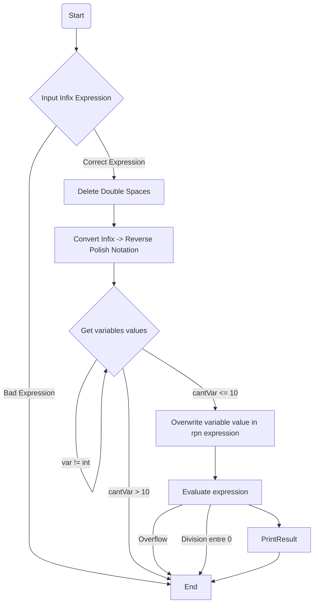

# ARM32 Assembly to Solve Math Expressions

This project involves developing a program to solve mathematical expressions using ARM assembly language on a `Raspberry Pi`. The objective is to leverage the low-level programming capabilities of `ARM assembly` to create an efficient and compact solution for evaluating mathematical expressions. 

For solving the arithmetic math expressions given by the user we will need to convert our expressions into a `reverse Polish Notation` expression [1], by doing so, using the `stack`, we can calculate the result.

## Hardware and Software Requirements

### Hardware: 
- Raspberry Pi (any model with ARM architecture)
### Software:
- Raspberry Pi OS (formerly Raspbian)
- ARM assembly compiler (e.g., as - the GNU Assembler)
- Standard development tools (e.g., gcc for linking, gdb for debugging)

---

## Implementation Goals 

The expression to be solved is provided by the user as a string input. The program should be able to parse the numbers and operands

By using the Reverse Polish Notation, the program can be able to output the results from the expression.

---

## Reverse Polish Notation
Reverse Polish Notation (RPN), also known as postfix notation, is a mathematical notation in which operators follow their operands. It eliminates the need for parentheses used in infix notation, simplifying calculations and reducing ambiguity. Converting infix expressions (like A * (B + C) / D) to RPN (like A B C + * D /) involves a systematic process that respects operator precedence and parentheses. Understanding and applying these rules can enhance computational efficiency and is fundamental in various computer science applications, such as in stack-based calculators and expression evaluation in programming languages. This guide outlines the rules and provides a step-by-step method for converting infix expressions to RPN.

### Operator Precedence Chart

| Operator | Precedence |
|----------|------------|
|    )     |     5      |
|    (     |     5      |
|    ^     |     4      |
|    *     |     3      |
|    /     |     3      |
|    +     |     2      |
|    -     |     2      |

---

### Operands:

- If the character is an operand (e.g., a variable or a number), add it directly to the output string.

### Operators:
When you read an operator (like +, -, *, /):
- Compare it with the operator on the top of the stack.
- If the stack is empty or has a left parenthesis ( on top, PUSH the current operator onto the stack.
- If the operator is greater in precedence than top of stack, push.
- If the operator is equal o less in precedence than top of stack, POP top operator from stack, put it on output string, PUSH current operator to stack until the next top precedence is lower than the actual operador.

### Left Parenthesis (:

- If the character is a left parenthesis (, push it onto the stack.
  
### Right Parenthesis ):

- If the character is a right parenthesis ), pop from the stack to the output string until a left parenthesis ( is at the top of the stack. Pop and discard the left parenthesis.

### End of Expression:

- When the end of the infix expression is reached, pop all operators from the stack to the output string.

---

### Examples used in the program

### Input value for every variable

---

## Evaluate Expression

After converting infix to reverse Polish Notation, the next step is to evaluate the expression. For doing such task, we will need to use back our friend the *STACK*.

Using the stack, we push the operands (numbers and letters) from left to right. When we encounter an operator, we pop two operands from the stack and we evaluate the arithmetic expression, after getting the result, we push the result into the stack. If the expression is out of operators, it means we have reached to the end of the evaluation.

### Example:

We have the following RPN expression `12 3 * 4 3 - +` | Original expression: `( 12 * 3 ) + ( 4 - 3 )`

First we push the numbers

|   STACK  |
|----------|
|    12    |
|    3     |

We now encounter a multiplication operator `*`, so, we pop the last two numbers out of the stack, and we multiply them, which will give us `36`, with the result 36, we push it into the stack. Then we push the other two numbers. (3, 4)

|   STACK  |
|----------|
|    4     |
|    3     |
|    36    |

After pushing 3 and 4, we encounter `-` sign, we need to substract, giving us the result of `1`, we push `1` into the stack

|   STACK  |
|----------|
|    1     |
|    36    |

The next character in the expression is `+` operator, we need to pop the two numbers left in the stack and make an addition. This will give the final result of `37`.

---

# Flow Diagram

The program starts, the first thing it does is to ask the user to input the math expression.

After getting the input, we delete the enter at the end, and we check:
  - Is the input empty? If so, end program.
  - Are the parenthesis written correctly? if not, end program.
  - Is the expression written correctly? if not, end program. (MISSING)

Passing all checks, its time to convert infix expression into reverse Polish Notation

For doing such task, it is recommended to read the previous section for a better understanding on how the convertion works.

After converting into reverse polish notation, the next thing to do is ask for the values of each variable.

For every value we input, we need to check if it is a correct value. If the value is correct, the next step is to overwrite the polish notation, where we encounter the variable we are working on, we change the variable for the value. During this phase, we check if the quantity of variables we have in the list is less or equal to 10, if greater, end the program with an error message.

Subsequent to changing the variables, we can finally evaluate the expression, as said before, it is recommended to read the previous section to get a better understanding how evaluation works. If the evaluation produces an overflow or we divide with 0, it will throw an error message.

# Block Diagrams

In this section, we will cover some of the most important blocks in this program.

### Infix To RPN Block Diagram

In this block, we receive the infix expression we entered as input. For every character it has, we first compare if the character is equal to `0`, if so, pop all the remaining operators out of the stack and store them in the output, giving us the reverse polish notation.

- If the character is `)`, push it directly to the stack.
- If the character is `(`, pop until finding the closing parenthesis.
- If it is a `number`, store it in the output.
- If it is a `variable`, store it in the output
- If it is an operator, compare top of the stack, if top <= actual, pop top, store top in output. If the next top < actual, pop top, store in output and lastly push actual operator.

### Get Variables values Block Diagram

In this block, we get the values of each variable, the logic for this code is the following

Lets suppose you have `a 2 + b -` as the RPN expression, so you need to change `a` & `b` variable for a number. So the first thing we need to do is get the value of `a`, lets say we give him a 50,

the next step is to change whenever we encounter the letter a in the RPN expression change it for 50, so in this case the result will be `new_rpn = 50 2 + b -`. Now we need to get the value for `b`,

Lets give `b` the value of 2, now `rpn = 50 2 + 5 -`. For each iteration we need to clean `rpn` first and copy `rpn` the new value of `new_rpn`, by doing so, we prevent the mix of values in the RPN

About the diagram, as said previously, we receive a variable from the list of variables, we compare if we have reached to the end the variables, if so, we have finished the overwriting.

If we haven't reached to the end, then we ask for the value, if the value we get is not a number, ask again.

The next step is to overwrite, whenever we encounter the variable we are working on in the RPN expression, overwrite it with the value we have entered.

Clean RPN, and copy NEW_RPN to RPN, repeat the process.
  
### Evaluate Block Diagram

In this block section, we evaluate the expression from new_rpn. We get the character from new_rpn, if character is equal to 0, we already finish evaluating.

If the character is equal to 20h, which is a `space`, we ignore it, and we get to the next character.

If the character is an operator, we pop two times the stack to get the last two numbers we stored in the stack and we evaluate with the current operator.

If the character is a number, we read the number from ASCII to INT, then push it into the stack.

---

# References:
[1] Wikipedia contributors, “Reverse Polish notation,” Wikipedia, Apr. 27, 2024. https://en.wikipedia.org/wiki/Reverse_Polish_notation

[2] Erb Computer Science, “Reverse polish notation using stacks,” YouTube. Jun. 19, 2019. [Online]. Available: https://www.youtube.com/watch?v=QxHRM0EQHiQ

[3] Back To Back SWE, “Reverse polish notation: types of mathematical notations & using a stack to solve RPN expressions,” YouTube. Feb. 25, 2019. [Online]. Available: https://www.youtube.com/watch?v=qN8LPIcY6K4

[4] Raspberry Pi, "Raspberry Pi". https://www.raspberrypi.com/

[5] Arm.syscall.sh. (n.d.). arm.syscall.sh. https://arm.syscall.sh/

[6] Mermaid Chart - Create complex, visual diagrams with text. A smarter way of creating diagrams. (n.d.-b). https://www.mermaidchart.com/

[7] MIRO | The Visual Workspace for Innovation. (n.d.). https://miro.com/
